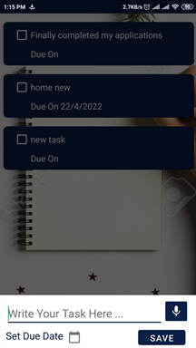

# Agenda
Create a Agenda app managing with Firebase ,a seamless, high-performing app .Manage your tasks and collaborate with others during projects. Like similar products, it saves your stuff in the cloud. Also it support voice to text features .

## Features
- User login 
- Create Todo List Items into Todo List.
- Update, Delete and Complete actions for Todo List Item.
- Support voice to text features
- User can check or uncheck the task after completing
- Provide Swipe Features so u can delete or edit your Task.
  
## Libraries
- [Recycler View Swipe Decorator](https://github.com/xabaras/RecyclerViewSwipeDecorator): providing the swipe features so we can easily delete & edit the task

## Support
- Android 6.0+

## Planned Features

- **Backlog**     → a simple idea 

- **Ready**       → idea now is a possible feature waiting to be developed

- **In progress** → feature being developed

## Download Now 

- [Agenda](Agenda.apk)

## ScreenShots

